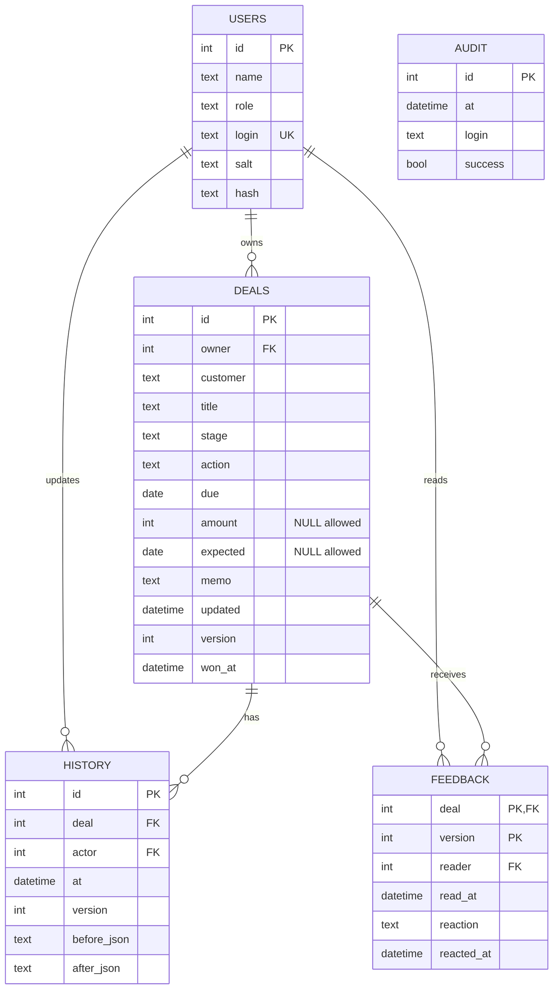
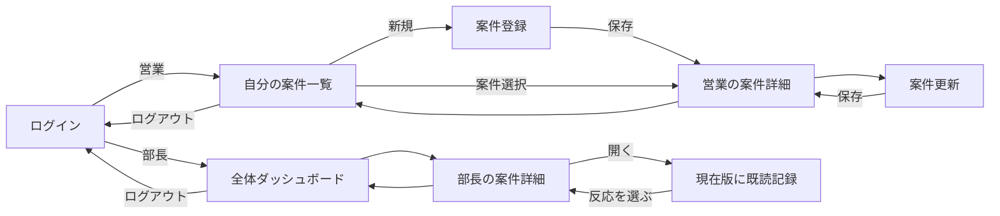

# データと画面の設計

PythonのHTTPサーバーがAPIと静的画面を返し、SQLiteに永続化する。外部サービスへ案件を送信しない。最小の2役割で、営業は自分の案件のみ、部長は全件閲覧と既読・反応のみを操作できる。

## ER図

顧客は試作では独立マスタにせず文字列。顧客名入力の候補は営業本人の既存案件から提示する。金額はNULLと0を区別。日時はISO 8601の日本時間。feedbackの主キーは案件と版番号の組み合わせで、古い反応を現在版の確認に流用しない。AUDITは存在しないIDによるログイン失敗も記録するため、利用者IDを外部キーにしない。

## 画面遷移図

登録・更新は同じフォーム部品を使うが、登録時は空欄、更新時は前回値を表示。営業用詳細も設け、変更履歴と部長の反応を読めるようにした。原要件の4画面にログイン・登録・営業詳細を補った構成である。

## 保存と例外

入力検証→トランザクション開始→権限・現在版の検査→案件保存と履歴追加→コミット→成功応答。SQLiteのBEGIN IMMEDIATEで書き込み順を確定し、古い版を409で拒否する。新規登録の重複検査も同じトランザクション内で行う。保存ボタンは通信中無効。通信失敗・422・409はフォーム内に表示し、入力値を残す。登録後の応答だけが失われた場合は、再送時に重複検査で拒否するので、一覧で登録有無を確認する。

## 画面下書き

コードで描いた閲覧用の下書きとER・遷移の簡略図を [design.html](design.html) に同梱する。完成画面のキャプチャは別資料。下書きの作成時点を実装前だったと偽ってはいない。

一覧：見込み／確定／要注意のカード→検索・絞り込み→案件行。登録：2列の短い入力欄→一言メモ→保存。詳細：最新状況→履歴、右側に既読と反応。スマホでは1列にし、一覧表だけを横スクロール可能にする。
